# 📅 Agenda Personal Android con Kotlin

Proyecto de una aplicación **Agenda Personal** desarrollada en **Android Nativo** utilizando **Kotlin** como lenguaje principal.  
El objetivo es demostrar las características fundamentales de Kotlin, su interoperabilidad con Java y las ventajas frente a Java tradicional.

---

## 🚀 Tecnologías y Entorno

- **Lenguaje principal:** Kotlin
- **Interoperabilidad:** Integración con clases en Java
- **IDE:** Android Studio
- **SDK:** Android 8.0+
- **Arquitectura:** Separación de responsabilidades (UI, lógica de negocio, utilidades)
- **Patrones:** Singleton, Factory Pattern (Companion Object)
- **Material Design Components:** MaterialDatePicker, Chip, Snackbar, AlertDialog, Toast

---

## ✨ Funcionalidades Implementadas

### 1. Registro de Eventos
- Ingreso de **título** (obligatorio)
- Selección de **fecha** con `MaterialDatePicker`
- **Descripción** (opcional)
- Validación de campos
- Generación de **ID único** usando interoperabilidad con Java

### 2. Listado y Filtrado
- Filtros con **chips**:
  - Todos los eventos
  - Eventos de hoy
  - Eventos próximos
- **Búsqueda en tiempo real** por título
- **Ordenamiento** por fecha ascendente

### 3. Gestión de Eventos
- Ver detalle completo en **diálogo**
- **Eliminar** con confirmación mediante `Snackbar`
- Estado vacío informativo
- Mensajes de **éxito/error** con `Toast`

---

## 🛠️ Características de Kotlin Implementadas

- Uso de **var, val y lateinit**
- **Data classes** para entidades
- **Singletons** con `object`
- **Companion Objects** como **Factory Pattern**
- **Lambdas y Arrow Functions**
- Manejo exhaustivo de **Null Safety** (`?.`, `?:`, `takeIf`, `isNullOrBlank()`)
- Uso de **Funciones Estándar**: `apply`, `let`, `takeIf`, `forEach`, `when`
- **Funciones de Extensión** (`EditText.safeText()`)

---

## 📂 Arquitectura del Proyecto

- **MainActivity** → Lógica de UI y eventos
- **EventManager** → Gestión centralizada de datos (Singleton)
- **EventFilter** → Lógica de filtrado
- **DateUtils** → Utilidades de fecha
- **UIHelpers** → Helpers para interfaz
- **Extensions** → Funciones reutilizables

---

## ⚙️ Ejecución del Proyecto

### Compilar
```bash
./gradlew assembleDebug
```

### 🔄 Vistas de Interacción con la Aplicación

1. **Pantalla Principal**

<p float="left">
  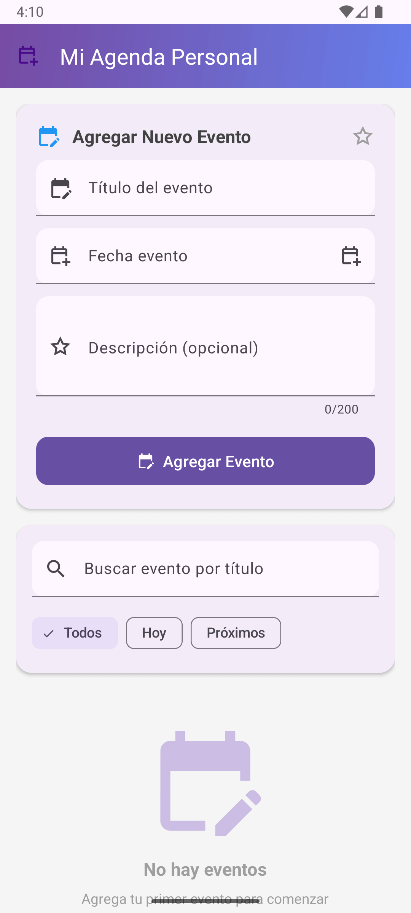
  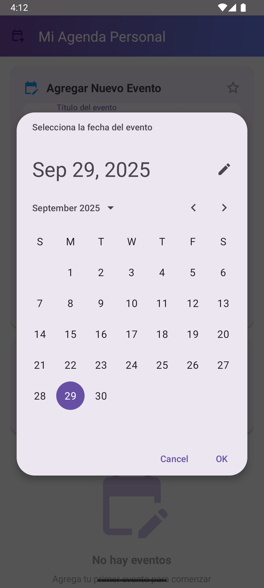
  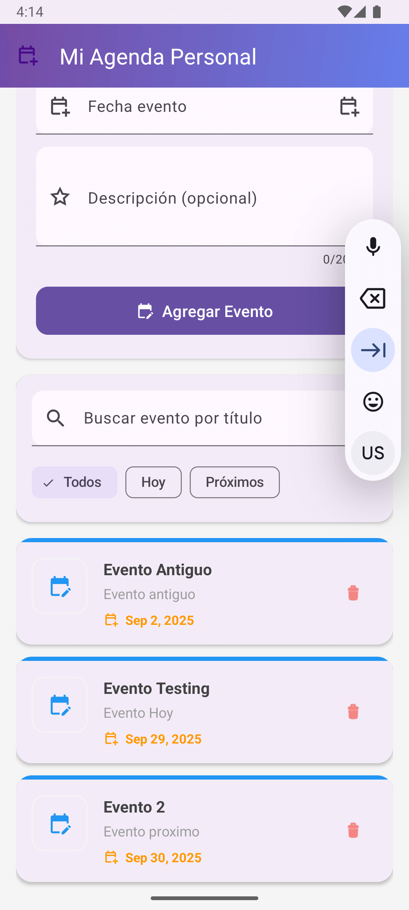
  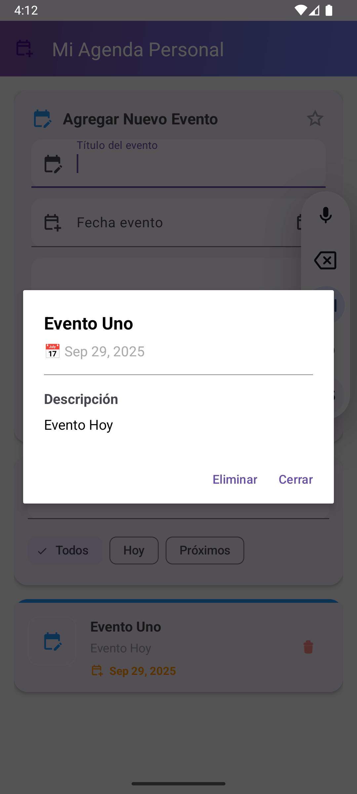
</p>

2. **Filtrar eventos**

<p float="left">
  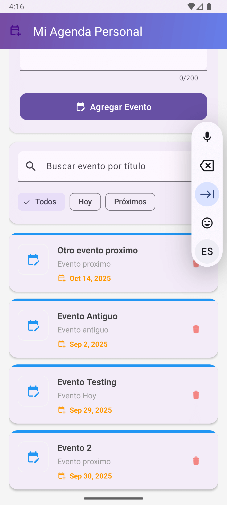
  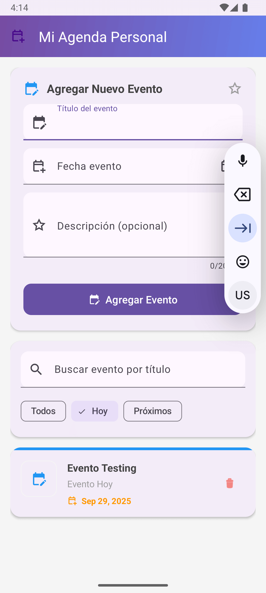
  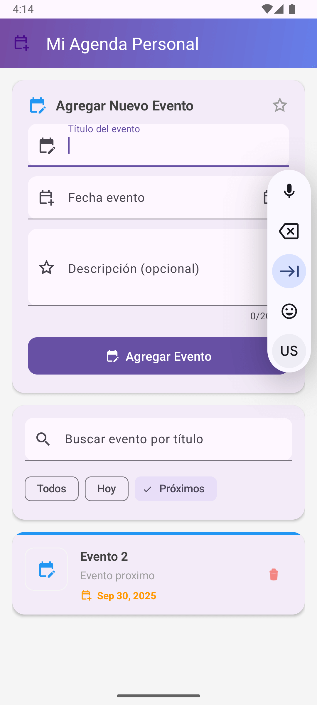
  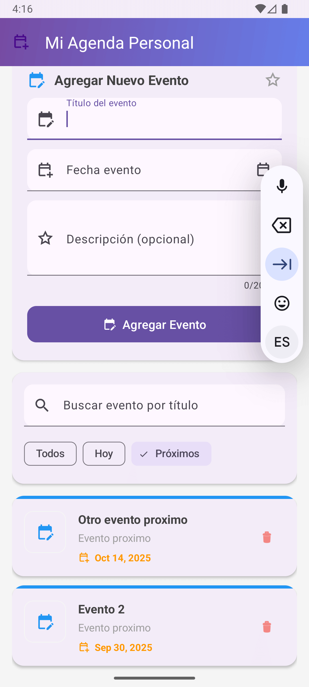
  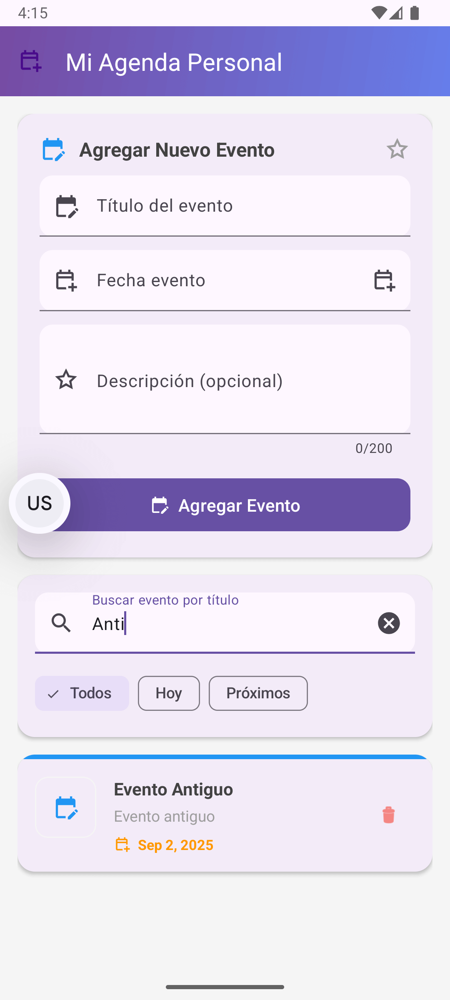
  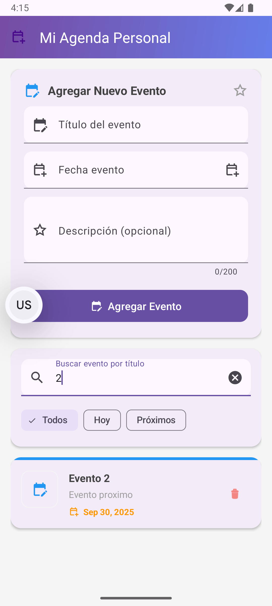
</p>

3. **Feedbacks: Toast y Snackbar**
<p float="left">
  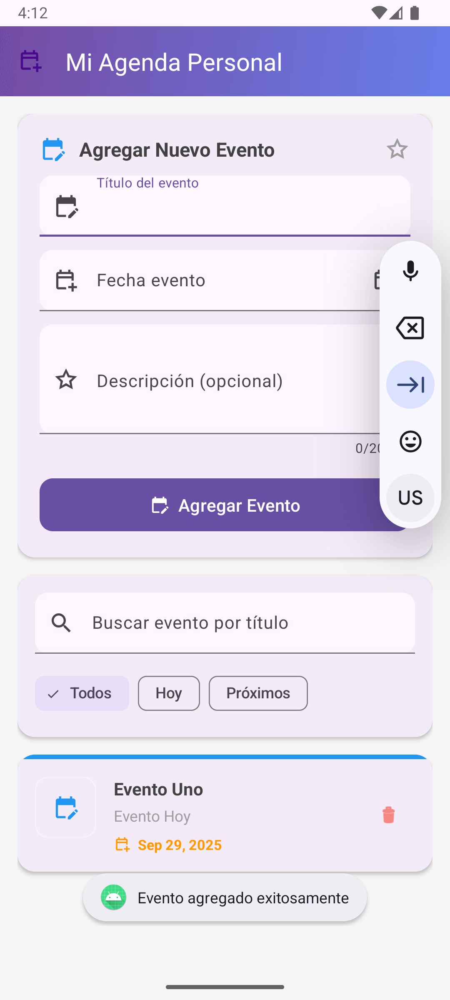
  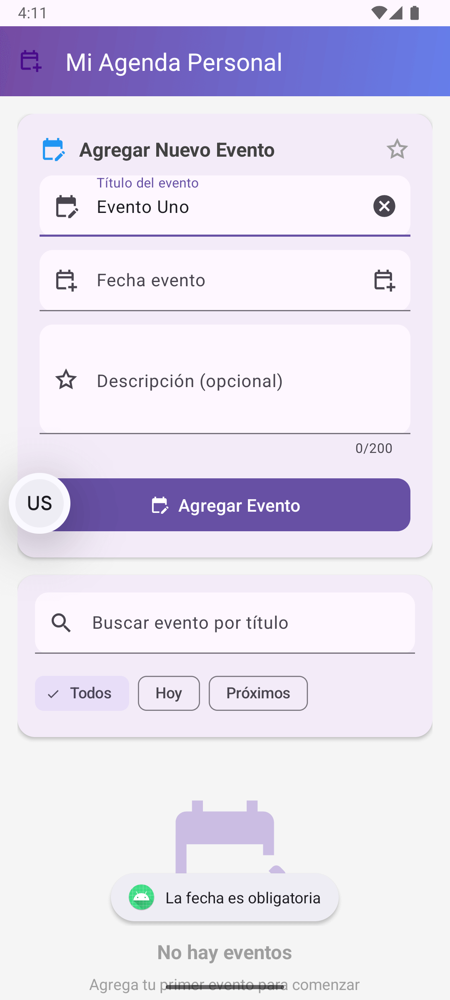
  
  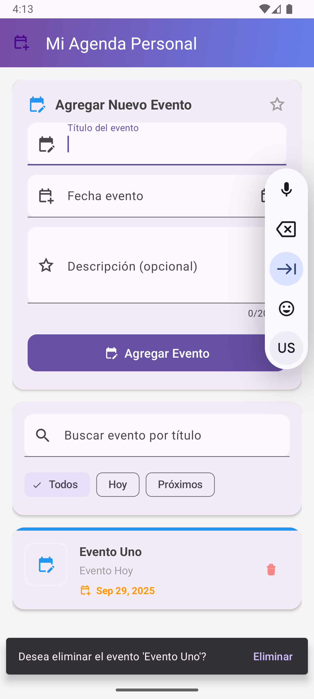
  
</p>